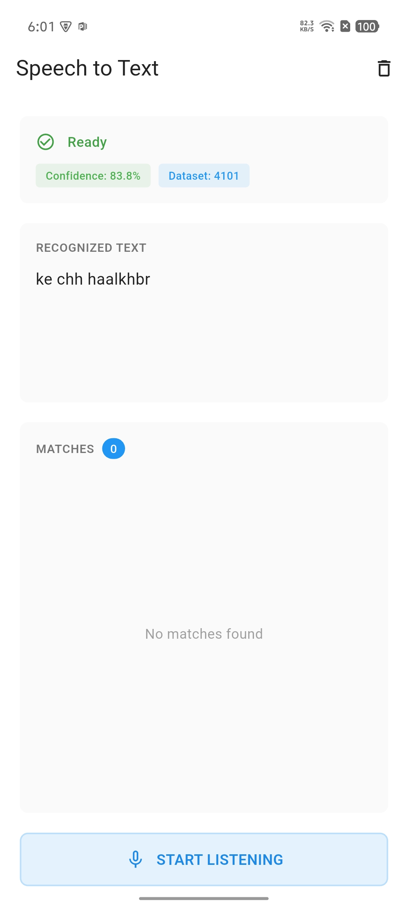

# Speech to Text App



A Flutter application that converts speech to text, supporting both English and Nepali (Romanized) language recognition.

## Features

- 🎤 **Real-time Speech Recognition**: Convert spoken words to text instantly
- 🌐 **Bilingual Support**: Supports both English and Nepali (Romanized) speech recognition
- 📊 **Dataset Integration**: Uses a comprehensive Nepali-English word dataset
- 🏗️ **Clean Architecture**: Built with BLoC pattern and dependency injection
- 🎨 **Modern UI**: Clean and intuitive user interface

## Getting Started

### Prerequisites

- Flutter SDK (3.0 or higher)
- Dart SDK (3.0 or higher)
- Android Studio / VS Code with Flutter extensions
- Physical device or emulator with microphone access

### Installation

1. Clone the repository
```bash
git clone <your-repository-url>
cd <project-directory>
```

2. Install dependencies
```bash
flutter pub get
```

3. Generate dependency injection code
```bash
flutter pub run build_runner build --delete-conflicting-outputs
```

4. Run the app
```bash
flutter run
```

## Dependencies

### Main Dependencies

| Package | Version | Purpose |
|---------|---------|---------|
| [cupertino_icons](https://pub.dev/packages/cupertino_icons) | ^1.0.8 | iOS style icons |
| [speech_to_text](https://pub.dev/packages/speech_to_text) | ^7.3.0 | Speech recognition functionality |
| [flutter_bloc](https://pub.dev/packages/flutter_bloc) | ^9.1.1 | State management |
| [equatable](https://pub.dev/packages/equatable) | ^2.0.8 | Value equality comparison |
| [get_it](https://pub.dev/packages/get_it) | ^9.2.0 | Service locator for dependency injection |
| [injectable](https://pub.dev/packages/injectable) | ^2.7.1+4 | Code generation for dependency injection |
| [dartz](https://pub.dev/packages/dartz) | ^0.10.1 | Functional programming (Either, Option) |

### Dev Dependencies

| Package | Version | Purpose |
|---------|---------|---------|
| [flutter_lints](https://pub.dev/packages/flutter_lints) | ^6.0.0 | Recommended lints for Flutter |
| [build_runner](https://pub.dev/packages/build_runner) | ^2.10.5 | Code generation tool |
| [injectable_generator](https://pub.dev/packages/injectable_generator) | ^2.12.0 | Generates dependency injection code |

## Dataset

The app uses a JSON dataset located at `assets/data_set.json` containing Nepali-English word mappings.

### Dataset Format

```json
{
  "unique_identifier": "nep1",
  "native word": "परिस्कृत",
  "english word": "pariskrit",
  "source": "AK-Freq"
}
```


## Permissions

### Android
Add the following permissions to `android/app/src/main/AndroidManifest.xml`:

```xml
<uses-permission android:name="android.permission.RECORD_AUDIO"/>
<uses-permission android:name="android.permission.INTERNET"/>
```

### iOS
Add the following to `ios/Runner/Info.plist`:

```xml
<key>NSMicrophoneUsageDescription</key>
<string>This app needs microphone access for speech recognition</string>
<key>NSSpeechRecognitionUsageDescription</key>
<string>This app needs speech recognition permission</string>
```

## Usage

1. Launch the app
2. Grant microphone permissions when prompted
3. Select language (English or Nepali)
4. Tap the microphone button to start recording
5. Speak clearly into the device
6. View the transcribed text in real-time

## Building for Production

### Android APK
```bash
flutter build apk --release
```

### Android App Bundle
```bash
flutter build appbundle --release
```

### iOS
```bash
flutter build ios --release
```

## Troubleshooting

### Speech Recognition Not Working
- Ensure microphone permissions are granted
- Check device microphone is functioning
- Verify internet connection (required for some speech recognition services)

### Build Runner Issues
```bash
flutter pub run build_runner clean
flutter pub run build_runner build --delete-conflicting-outputs
```

## Contributing

Contributions are welcome! Please follow these steps:

1. Fork the repository
2. Create a feature branch (`git checkout -b feature/AmazingFeature`)
3. Commit your changes (`git commit -m 'Add some AmazingFeature'`)
4. Push to the branch (`git push origin feature/AmazingFeature`)
5. Open a Pull Request

## License

This project is licensed under the MIT License - see the LICENSE file for details.

## Acknowledgments

- Dataset source: AK-Freq
- Flutter community for excellent packages
- Contributors and testers

## Contact

For questions or support, please open an issue in the repository.

---

**Note**: This app requires an active internet connection for speech recognition services to function properly.
